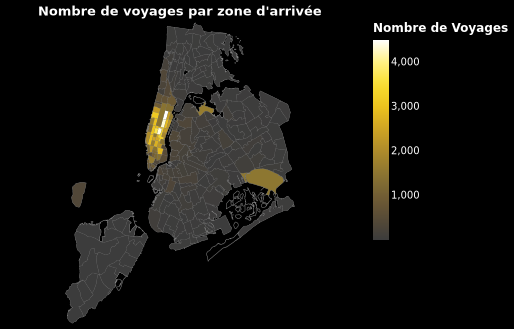
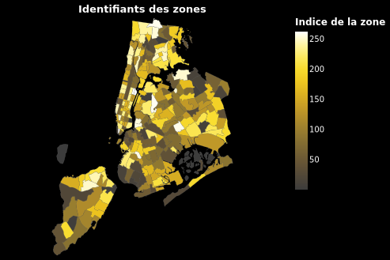
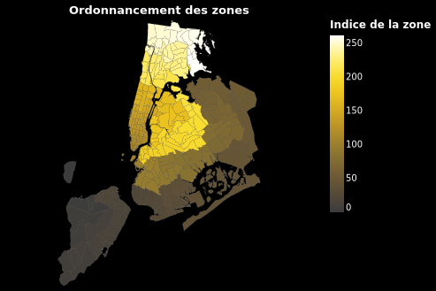

# Anonymisation  des Voyages en Taxi de New York

Ce projet a pour objectif d'explorer et de visualiser les données des trajets en taxi de New York, en utilisant des outils de cartographie et de traitement des données. Il comprend des scripts pour télécharger, filtrer, anonymiser et visualiser les données de manière interactive.

## Table des matières

- [Prérequis](#prérequis)
- [Cartograhie](#Cartograhie)
- [Utilisation](#Utilisation)
- [Auteur](#auteur)
- [Licence](#licence)

## Prérequis

Avant de commencer, assurez-vous d'avoir les outils et les dépendances suivantes installés sur votre système :

- `wget` pour télécharger des fichiers.
- `dsq` pour exécuter des requêtes SQL sur des données JSON.
- `jq` pour traiter des données JSON.
- `pimo` pour effectuer des transformations basées sur l'algorithme du Voyageur de Commerce.
- `sigo` pour l'anonymisation des données.
- `node_modules/vega-lite` pour générer des visualisations Vega-Lite.

Vous pouvez également utiliser la configuration devcontainer ou code space pour un environnement pré-configuré.

## Cartograhie

### Carte du Nombre de Voyages par Zone d'Arrivée

Ci-dessous, vous trouverez des cartes illustrant le nombre de voyages en taxi le 23 juin 2023 par zone d'arrivée pour les données originales

et pour les données anonymisées avec SIGO.

Le fichier `src/vega/Nombre_de_voyages_par_zone_d'arrivée.vg.json` contient une spécification Vega-Lite pour créer une carte interactive illustrant le nombre de voyages par zone d'arrivée à New York.

 - Source de Données : Utilise un fichier TopoJSON pour représenter les zones géographiques et un fichier yellow-tripdata_2023-06-23.json pour les données sur les voyages en taxi.
 - Couches de Visualisation : Deux couches superposées : les limites des zones et une coloration basée sur le nombre de voyages par zone d'arrivée.

### Carte des Identifiants des Zones Géographiques

Le fichier `src/vega/Identifiants_des_zones.vg.solo.json` contient une spécification Vega-Lite pour créer une carte interactive des identifiants des zones géographiques de New York.

 - Source de Données : Utilise un fichier TopoJSON pour représenter les zones géographiques.
 - Couches de Visualisation : Deux couches superposées : les limites des zones et une coloration basée sur les indices.

### Carte de l'Ordonnancement des Zones Géographiques

Le fichier `src/vega/Ordonnancement_des_zones.vg.solo.json` contient une spécification Vega-Lite pour créer une carte interactive de l'ordonnancement des zones géographiques de New York, montrant visuellement comment elles sont réorganisées pour le problème du voyageur de commerce.

 - Source de Données : Utilise un fichier TopoJSON pour représenter les zones géographiques.
 - Source de Données de Référence : Utilise le fichier zone_index_cache.json comme référence pour l'ordonnancement des zones.
 - Couches de Visualisation : Deux couches superposées : les limites des zones et une coloration basée sur les indices.

## Utilisation

### Script `generating.sh`

Le script `generating.sh` est utilisé pour télécharger, filtrer et formater les données des taxis de New York à partir d'un fichier Parquet. Ce script est essentiel dans le processus de préparation des données pour nos analyses ultérieures. Voici une explication détaillée des étapes qu'il effectue :

1. **Téléchargement des données :** Le script commence par télécharger les données à partir de l'URL spécifiée, qui pointe vers un fichier Parquet contenant les informations sur les trajets en taxi de New York.

2. **Filtrage des données :** Ensuite, les données sont passées à travers l'outil `dsq`, qui exécute une requête SQL sur les données. La requête SQL sélectionne les colonnes importantes pour notre analyse, notamment les horaires de prise en charge et de dépôt, le nombre de passagers, la distance du trajet, ainsi que les identifiants de la zone de prise en charge et de la zone de dépôt. De plus, il y a des commentaires dans la requête qui peuvent être activés pour appliquer des filtres supplémentaires, tels que la sélection de zones spécifiques.

3. **Sauvegarde au format JSON :** Les données filtrées sont ensuite sauvegardées dans un fichier JSON à l'emplacement `src/data/original/all/yellow-tripdata_2023-06-23.json` à l'aide de la commande `tee`. Cela nous permet d'accéder facilement aux données dans un format lisible.

4. **Conversion au format JSONL :** Enfin, les données JSON sont converties au format JSONL (JSON Lines) à l'aide de l'outil `jq`. Cette conversion élimine les crochets qui entourent l'ensemble de données, ce qui facilite leur utilisation ultérieure dans nos analyses.

Ce script est une étape de préparation des données avant de les utiliser dans nos différentes analyses. Assurez-vous d'avoir les outils nécessaires, notamment `wget`, `dsq`, et `jq`, installés sur votre système pour exécuter ce script avec succès.

### Script `masking.sh`

Le script `masking.sh` est l'étape de l'anonymisation des données sur les trajets en taxi de New York. Voici un aperçu des étapes qu'il effectue :

1. **Lecture des données d'entrée :** Le script commence par lire les données d'entrée à partir du fichier JSONL `src/data/original/all/yellow-tripdata_2023-06-23.jsonl`. Ces données contiennent des informations sur les trajets en taxi.

2. **Utilisation de PIMO (Parcours du Voyageur de Commerce) :** Ensuite, le script utilise l'outil `pimo` pour effectuer des transformations basées sur l'algorithme du Voyageur de Commerce (TSP). Il modifie les index des zones en fonction du parcours du voyageur de commerce, ce qui permet de réorganiser les données spatialement pour des besoins d'anonymisation spécifiques.

3. **Utilisation de SIGO pour l'anonymisation :** Le script fait appel à SIGO, un outil d'anonymisation, en utilisant le fichier de configuration `conf/sigo.yaml`. Il demande à SIGO de rajouter un champ "box" dans le flux JSON, ce qui indique le groupe d'appartenance du trajet. Cette étape est nécessaire pour garantir que les données restent anonymes tout en conservant leur utilité.

4. **Reconversion avec PIMO :** Après l'anonymisation avec SIGO, le script utilise à nouveau l'outil `pimo` pour reconvertir les identifiants de zone dans leur format original. Cela garantit que les données restent interprétables et utiles pour nos analyses ultérieures.

5. **Sauvegarde des données anonymisées :** Enfin, les données anonymisées sont sauvegardées dans un fichier JSONL `src/data/sigo/all/yellow-tripdata_2023-06-23.jsonl`. Le script utilise `jq` pour formater les données et les stocke dans un fichier JSON `src/data/sigo/all/yellow-tripdata_2023-06-23.json`.

Ce script représente l'étape d'anonymisation essentielle pour garantir la confidentialité des données tout en maintenant leur pertinence pour nos analyses ultérieures. Assurez-vous d'avoir les outils nécessaires, notamment `pimo`, `sigo`, et `jq`, installés sur votre système pour exécuter ce script avec succès.

### Configuration de PIMO et SIGO

Dans le répertoire `conf/`, vous trouverez les fichiers de configuration essentiels pour les outils PIMO et SIGO, qui sont utilisés dans le processus d'anonymisation de nos données sur les trajets en taxi de New York.

#### Configuration de PIMO (masking-pre.yml et masking-post.yml)

- `masking-pre.yml`: Ce fichier de configuration est utilisé pour spécifier les transformations préliminaires des données avant l'anonymisation. Voici un aperçu des transformations spécifiées dans ce fichier :
  - Conversion de `DOLocationIDOrigin` en `DOLocationID`.
  - Application de masques pour `DOLocationID` et `PULocationID` en fonction des données de cache.
  - Conservation des données qui ne sont pas dans le cache.

- `masking-post.yml`: Ce fichier de configuration est utilisé pour spécifier les transformations à appliquer après l'anonymisation. Voici un aperçu des transformations spécifiées dans ce fichier :
  - Conversion de `DOLocationID` et `PULocationID` en types entiers.
  - Application de masques pour `DOLocationID` et `PULocationID` en fonction des données de cache.
  - Conservation des données qui ne sont pas dans le cache.

#### Configuration de SIGO (sigo.yaml)

Le fichier `sigo.yaml` contient la configuration pour SIGO, l'outil d'anonymisation que nous utilisons dans notre processus. Voici un aperçu des paramètres de configuration spécifiés dans ce fichier :
- `kAnonymity`: Le paramètre de k-anonymat, défini sur 3 dans cet exemple.
- `lDiversity`: Le paramètre de l-diversité, défini sur 2 dans cet exemple.
- `sensitives`: Les attributs sensibles, dans cet exemple, uniquement `DOLocationID`.
- `aggregation`: Le type d'agrégation utilisé pour masquer les données sensibles, défini sur "meanAggregation".
- `rules`: Les règles de masquage à appliquer aux attributs spécifiés.

Ces fichiers de configuration sont essentiels pour définir comment les données seront anonymisées et protégées tout en maintenant leur utilité pour nos analyses ultérieures.

### Script `filtering.sh`

Le script `filtering.sh` est utilisé pour filtrer les données des trajets en taxi de New York en fonction de différents critères tels que le nombre de passagers, l'heure et la localisation. Cette étape est importante pour préparer les données avant de les utiliser dans nos analyses. Voici comment fonctionne ce script :

1. **Boucle sur les ensembles de données :** Le script parcourt les ensembles de données d'origine (`original`) et anonymisés (`sigo`) pour appliquer les filtres successivement à chaque ensemble.

2. **Filtrage sur le nombre de passagers :** Le script commence par filtrer les trajets en fonction du nombre de passagers. Dans cet exemple, seuls les trajets avec trois passagers sont conservés. Les données filtrées sont sauvegardées dans le répertoire correspondant à la catégorie "passenger".

3. **Filtrage sur l'heure :** Ensuite, le script filtre les données en fonction de l'heure de prise en charge. Dans cet exemple, seuls les trajets effectués dans une plage horaire spécifique sont conservés. Les données filtrées sont sauvegardées dans le répertoire correspondant à la catégorie "date".

4. **Filtrage sur la localisation :** Enfin, le script filtre les données en fonction de la localisation de prise en charge. Dans cet exemple, seuls les trajets dont la zone de prise en charge est le quartier Soho (zone 211) sont conservés. Les données filtrées sont sauvegardées dans le répertoire correspondant à la catégorie "localisation".

Ce script est une étape importante pour nos analyses ultérieures, car elle nous permet de sélectionner des sous-ensembles de données spécifiques en fonction de nos besoins. Assurez-vous d'avoir les outils nécessaires, notamment `dsq`, installé sur votre système pour exécuter ce script avec succès.

### Script `plotting.sh`

Le script `plotting.sh` est utilisé pour générer des visualisations graphiques à partir de fichiers de données et de configurations Vega-Lite. Ces visualisations permettent de mieux comprendre les résultats de nos analyses sur les trajets en taxi de New York. Voici comment fonctionne ce script :

1. **Boucle sur les fichiers solo Vega-Lite** : Le script parcourt les fichiers Vega-Lite en solo (`*.vg.solo.json`) dans le répertoire `src/vega/`. Pour chaque fichier, il extrait le titre du fichier, génère un fichier de configuration temporaire, y ajoute le titre, puis utilise `jq` pour fusionner les fichiers de configuration et enfin `node_modules/vega-lite/bin/vl2png` pour générer une image PNG correspondante. Les images sont sauvegardées dans le répertoire `src/plot/` avec des noms correspondant aux titres des fichiers Vega-Lite.

2. **Boucle sur les ensembles de données** : Le script parcourt les ensembles de données d'origine (`original`) et anonymisés (`sigo`) ainsi que les différentes étapes du processus (telles que `all`, `passenger`, `date`, et `localisation`). Il répète le même processus que décrit ci-dessus pour chaque combinaison de fichier Vega-Lite et ensemble de données/étape. Les images générées sont sauvegardées dans le répertoire `src/plot/` avec des noms correspondant aux titres des fichiers Vega-Lite, le nom de l'ensemble de données et l'étape.

Ce script est essentiel pour visualiser les résultats de nos analyses et présenter les données d'une manière plus compréhensible. Il est utile pour explorer les données et les conclusions de nos analyses. Assurez-vous d'avoir les outils nécessaires, notamment `jq` et `node_modules/vega-lite`, installés sur votre système pour exécuter ce script avec succès.

## Auteur

Youen Péron pour CGI France

## Licence

Ce projet est sous licence GPLv3. Pour plus de détails, consultez le fichier LICENSE.
